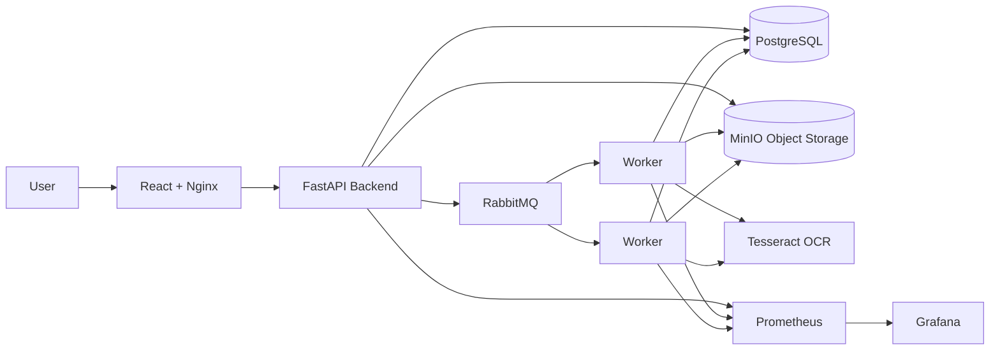

# Secure KYC Document Verification & Risk Assessment Platform

A containerized, asynchronous KYC document verification platform designed as a banking-oriented infrastructure and DevOps engineering project.

The platform accepts synthetic KYC documents, processes them asynchronously using OCR workers, validates extracted information, calculates an explainable risk level, and exposes the complete system through a monitored and Kubernetes-ready infrastructure.

> **Note:** This project uses synthetic/demo KYC documents only. No real personal identity documents should be uploaded.

---

## 1. Problem Statement

KYC verification systems need to process documents reliably while handling:

- Document uploads
- OCR processing
- Validation
- Risk assessment
- Asynchronous workloads
- Multiple concurrent processing jobs
- Failures and service recovery
- Authentication and authorization
- Secure configuration
- Monitoring and observability
- Containerized deployment
- Horizontal scaling

A synchronous architecture would make the API wait for OCR processing, increasing response time and reducing reliability.

This project uses an asynchronous architecture where document processing is delegated to background workers through RabbitMQ.

---

## 2. Solution

The platform follows this flow:

```text
User
  |
  v
React + Nginx
  |
  v
FastAPI Backend
  |
  +---------> PostgreSQL
  |
  +---------> MinIO
  |
  +---------> RabbitMQ
                  |
                  v
             Worker Pool
                  |
                  v
             OCR Processing
                  |
                  v
       Validation + Risk Assessment
                  |
                  v
             PostgreSQL
                  |
                  v
             React Dashboard
```

The API quickly accepts the document and creates a processing job.

Workers independently process jobs from RabbitMQ.

---

## 3. Architecture



---

## 4. Application Flow

### Step 1 — Authentication

Users register and log in using JWT authentication.

Roles are supported through RBAC.

### Step 2 — Document Upload

The backend validates:

- File type
- File size
- Ownership
- Safe object naming

Documents are stored in MinIO.

### Step 3 — Job Creation

A processing job is created in PostgreSQL.

A message is published to RabbitMQ.

The API returns without waiting for OCR processing.

### Step 4 — Worker Processing

Workers consume jobs from RabbitMQ.

The worker:

1. Retrieves the document
2. Performs OCR
3. Extracts fields
4. Identifies document type
5. Validates extracted fields
6. Calculates confidence
7. Calculates risk level
8. Stores the result

### Step 5 — Result

The frontend retrieves the verification result and displays:

- Document type
- Extracted information
- Confidence
- Risk level
- Risk reasons
- Verification status

---

## 5. Risk Assessment

The project uses a deterministic scoring approach.

Example:

```text
Required field detected
        |
        v
Field validation
        |
        v
Confidence calculation
        |
        v
Risk classification
```

Risk levels:

```text
LOW
MEDIUM
HIGH
```

The result also contains explainable risk reasons.

High-risk cases can be treated as requiring manual review.

---

## 6. Technology Stack

### Frontend

- React
- JavaScript
- Vite
- Nginx

### Backend

- Python
- FastAPI
- Pydantic
- SQLAlchemy
- Alembic
- JWT
- Password hashing

### Data & Messaging

- PostgreSQL
- MinIO
- RabbitMQ

### Processing

- Tesseract OCR
- pytesseract
- PyMuPDF

### Infrastructure

- Docker
- Docker Compose
- Kubernetes
- Terraform
- Ansible

### Observability

- Prometheus
- Grafana
- Request IDs
- Application logs
- Health checks

### CI/CD

- Git
- GitHub
- GitHub Actions

---

# 7. Security

Security was considered across application and infrastructure layers.

## Authentication

JWT-based authentication protects API endpoints.

## Authorization

Role-based access control is implemented for protected operations.

## Password Security

Passwords are stored as secure password hashes rather than plaintext passwords.

## Secrets

Sensitive Kubernetes configuration is injected through Kubernetes Secrets.

Non-sensitive configuration is stored separately using ConfigMaps.

Example:

```text
Kubernetes Secret
        |
        +---- DATABASE_URL
        +---- JWT_SECRET_KEY
        +---- MINIO credentials
        +---- RabbitMQ credentials
```

Actual local `.env` files are excluded from Git.

## Container Security

Backend and worker containers run as a non-root application user.

## File Validation

Uploaded documents are restricted by:

- Supported MIME types
- Maximum file size
- Safe generated object names

---

# 8. Asynchronous Processing

RabbitMQ decouples the API from OCR processing.

Instead of:

```text
Client
  |
  v
API
  |
  v
OCR
  |
  v
Response
```

the system uses:

```text
Client
  |
  v
API
  |
  +----> Store document
  |
  +----> Create job
  |
  +----> RabbitMQ
             |
             v
          Worker
             |
             v
          OCR
             |
             v
        Save result
```

This allows workers to scale independently from the API.

---

# 9. Docker Architecture

The Docker Compose environment contains:

```text
PostgreSQL
RabbitMQ
MinIO
FastAPI Backend
Worker
React + Nginx
Prometheus
Grafana
```

Persistent Docker volumes are used for local PostgreSQL, MinIO and Grafana data.

---

# 10. Kubernetes

The project is Kubernetes-ready and was tested using Docker Desktop Kubernetes.

Namespace:

```text
kyc-platform
```

Main workloads:

```text
Backend     -> 2 replicas
Worker      -> 2 replicas
Frontend    -> 1 replica
PostgreSQL  -> 1 replica
RabbitMQ    -> 1 replica
MinIO       -> 1 replica
```

Backend and worker replicas allow independent scaling.

---

## Kubernetes Services

```text
frontend
backend
postgres
rabbitmq
minio
```

Internal service-to-service communication uses Kubernetes DNS names.

Example:

```text
postgres:5432
rabbitmq:5672
minio:9000
```

---

# 11. Kubernetes Health Checks

The backend uses:

### Readiness Probe

Determines whether the application is ready to receive traffic.

```text
/api/v1/health
```

### Liveness Probe

Determines whether the application is still alive.

If the container becomes unhealthy, Kubernetes can restart it.

---

# 12. Self-Healing & Failure Testing

The Kubernetes deployment was tested by intentionally deleting running pods.

## Worker Failure

A worker pod was deleted.

Kubernetes automatically created a replacement pod.

Final state:

```text
worker
2/2 Running
```

## Backend Failure

A backend pod was deleted.

Kubernetes automatically created a replacement.

Final state:

```text
backend
2/2 Running
```

## RabbitMQ Failure

RabbitMQ was temporarily scaled to zero replicas.

The deployment was then restored to one replica.

Final state:

```text
rabbitmq
1/1 Running
```

The backend health endpoint was verified after recovery.

This demonstrates Kubernetes reconciliation and self-healing behaviour.

---

# 13. Observability

Prometheus collects metrics from the backend and workers.

Grafana is used for visualization.

### Backend metrics

Examples:

```text
http_requests_total
http_request_duration_seconds
```

### Worker metrics

Examples:

```text
kyc_jobs_processed_total
kyc_jobs_failed_total
kyc_jobs_processing
kyc_job_processing_seconds
```

---

## Important Monitoring Metrics

### Request Rate

```promql
rate(http_requests_total[5m])
```

### Average Request Latency

```promql
rate(http_request_duration_seconds_sum[1m])
/
rate(http_request_duration_seconds_count[1m])
```

### P95 Latency

```promql
histogram_quantile(
  0.95,
  sum by (le) (
    rate(http_request_duration_seconds_bucket[5m])
  )
)
```

### Worker Processing Rate

```promql
rate(kyc_jobs_processed_total[5m])
```

---

# 14. Request Correlation IDs

Requests receive an `X-Request-ID`.

Example:

```text
Client Request
      |
      v
X-Request-ID
      |
      v
FastAPI
      |
      v
Logs / debugging
```

This makes tracing individual requests easier during troubleshooting.

---

# 15. CI/CD

GitHub Actions performs:

```text
Git Push
   |
   v
GitHub Actions
   |
   +---- Backend dependency installation
   |
   +---- Backend import validation
   |
   +---- Frontend build
   |
   +---- Docker image build
   |
   v
CI Success
```

The pipeline currently contains separate jobs for:

- Backend CI
- Frontend CI
- Docker Build

The workflow was successfully executed on GitHub Actions.

---

# 16. Infrastructure as Code

## Terraform

Terraform was used to demonstrate infrastructure provisioning using the Docker provider.

The Terraform demo creates a Docker Nginx container.

The workflow demonstrates:

```text
terraform init
terraform plan
terraform apply
terraform state list
terraform destroy
```

Terraform was also tested for idempotent apply behaviour.

---

## Ansible

Ansible was used to demonstrate configuration management.

The playbook creates:

```text
/opt/kyc-platform
```

and manages an infrastructure configuration file.

The playbook was tested multiple times and demonstrated idempotent behaviour.

---

# 17. AWS Production Architecture

The current Kubernetes implementation can be mapped to AWS managed services.

```text
                    Users
                      |
                      v
                CloudFront / ALB
                      |
                      v
                    EKS
             +--------+--------+
             |                 |
          FastAPI           Workers
             |                 |
       +-----+-----+-----------+
       |           |           |
       v           v           v
      RDS     Amazon MQ       S3
  PostgreSQL   RabbitMQ    Documents
       |
       v
    Results
```

### Mapping

| Current Component | AWS Service |
|---|---|
| Docker Images | Amazon ECR |
| Kubernetes | Amazon EKS |
| PostgreSQL | Amazon RDS |
| MinIO | Amazon S3 |
| RabbitMQ | Amazon MQ |
| Kubernetes Secrets | AWS Secrets Manager |
| Logs | Amazon CloudWatch |
| Prometheus | Amazon Managed Service for Prometheus |
| Grafana | Amazon Managed Grafana |
| React/Nginx | CloudFront / ALB |

No AWS infrastructure is required to run the current demonstration.

---

# 18. Local Setup

Clone the repository:

```bash
git clone <repository-url>
cd kyc-platform
```

Create the backend environment file:

```text
backend/.env
```

Configure the required environment variables.

Then start the application:

```bash
docker compose up -d --build
```

Check services:

```bash
docker compose ps
```

Frontend:

```text
http://localhost:8080
```

Prometheus:

```text
http://localhost:9090
```

Grafana:

```text
http://localhost:3000
```

RabbitMQ management:

```text
http://localhost:15672
```

MinIO console:

```text
http://localhost:9001
```

---

# 19. Kubernetes Setup

Make sure Docker Desktop Kubernetes is enabled.

Check:

```bash
kubectl get nodes
```

Create namespace:

```bash
kubectl create namespace kyc-platform
```

Apply infrastructure manifests:

```bash
kubectl apply -f k8s/
```

Check workloads:

```bash
kubectl get pods -n kyc-platform
```

Check deployments:

```bash
kubectl get deployments -n kyc-platform
```

Run database migrations:

```bash
kubectl exec -n kyc-platform deployment/backend -- alembic upgrade head
```

Access frontend locally:

```bash
kubectl port-forward -n kyc-platform service/frontend 8081:80
```

Then open:

```text
http://localhost:8081
```

---

# 20. Current Infrastructure Capabilities

The project demonstrates:

- Containerized application architecture
- Docker Compose
- Kubernetes deployments
- Kubernetes services
- Horizontal replicas
- Kubernetes self-healing
- Readiness probes
- Liveness probes
- Kubernetes Secrets
- Kubernetes ConfigMaps
- Asynchronous processing
- RabbitMQ worker architecture
- Object storage
- OCR processing
- Prometheus metrics
- Grafana dashboards
- Request correlation IDs
- Operational logging
- GitHub Actions CI
- Terraform
- Ansible
- AWS architecture mapping

---

# 21. Future Improvements

Possible production improvements include:

- PostgreSQL persistent volumes / Amazon RDS
- S3 instead of MinIO
- RabbitMQ clustering
- RabbitMQ durable storage
- Transactional outbox pattern
- Dead-letter queues
- Retry policies
- Kubernetes HPA
- PodDisruptionBudgets
- NetworkPolicies
- TLS
- External Secrets Operator
- AWS Secrets Manager
- Image vulnerability scanning
- Container image signing
- Centralized JSON logging
- Distributed tracing
- Automated Kubernetes deployment from CI/CD

---

# 22. Engineering Highlights

The main engineering focus of this project is not only document OCR.

The project demonstrates how to design a service that is:

```text
Secure
   +
Asynchronous
   +
Observable
   +
Scalable
   +
Recoverable
   +
Automated
```

The infrastructure is designed so that application processing can continue independently from API request handling, workers can scale separately, failures can be detected and recovered, and operational behaviour can be observed through metrics and logs.

---

# 23. Interview Explanation

### 30-second version

> I built a secure KYC document verification platform using React, FastAPI, PostgreSQL, MinIO and RabbitMQ. Instead of processing OCR synchronously, the backend creates jobs in RabbitMQ and independent workers perform OCR, validation and risk assessment. I containerized the complete system using Docker and deployed it on Kubernetes with multiple backend and worker replicas, health probes and Kubernetes Secrets. I also added Prometheus and Grafana monitoring, request IDs, GitHub Actions CI, Terraform and Ansible. I tested pod failures and verified Kubernetes self-healing.

### Infrastructure focus

The key infrastructure concepts demonstrated are:

```text
Containerization
Kubernetes
Service Discovery
Horizontal Scaling
Self-Healing
Health Checks
Secrets Management
Message Queues
Observability
CI/CD
Infrastructure as Code
Cloud Architecture
```

---

## Disclaimer

This project is an educational prototype intended for infrastructure, DevOps and software engineering learning.

Only synthetic/demo KYC documents should be used.